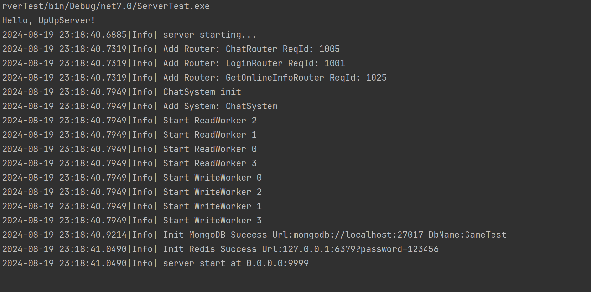
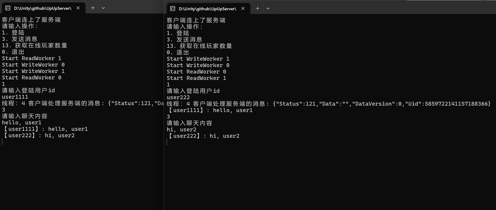

# 介绍

一个简单的服务端rpc框架
- UpUpServer, 框架核心
- ServerTest, 服务示例
- ClientTest, 客户端示例

# 使用
- 本地需要安装MongoDB
- ServerTest实现了登录和聊天逻辑，参考 ServerTest/RpcHandler目录中的实现

# Demo
- ServerTest 运行示例

- ClientTest 运行示例
